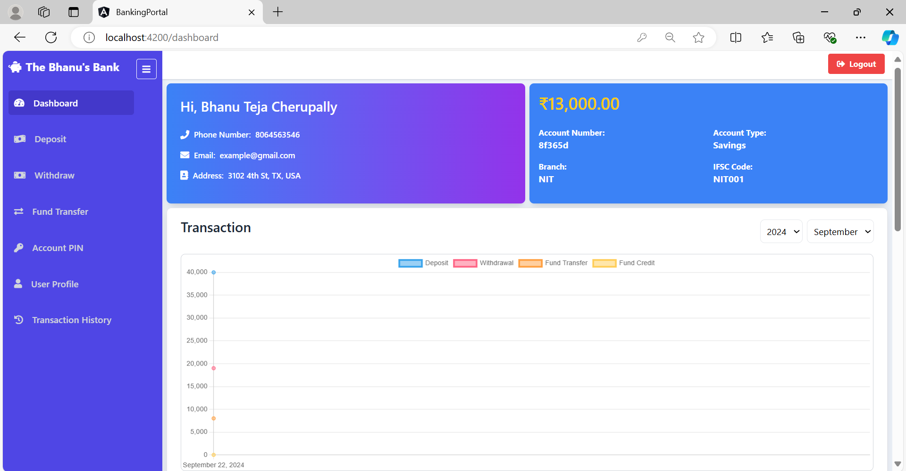

# The Bhanu's Bank - Frontend

This is the frontend part of **The Bhanu's Bank** project. This project serves as a user interface for performing various banking operations such as deposits, withdrawals, fund transfers, and more.

## Features:
- **Secure Transactions**: Your transactions are encrypted for security.
- **Easy Fund Management**: Manage your funds with a simple interface.
- **Multi-User Support**: Supports multiple users for personal or business accounts.
- **Transaction History**: View detailed records of all transactions.

### Home Page


### Dashboard Overview


### Transaction History


### Deposit Money


### Withdraw Money


### Fund Transfer


### Generate PIN


### User Profile


## Setup Instructions:
1. Clone the repository:
   ```bash
   git clone https://github.com/cherupallybhanuteja/bhanu-bank-frontend.git
2. Navigate to the project directory:
   cd bhanu-bank-frontend

3. Install dependencies:
   npm install

4. Start the development server:
   npm start

5. Open your browser and visit:
   http://localhost:4200

Technologies Used:

Angular

Tailwind CSS
